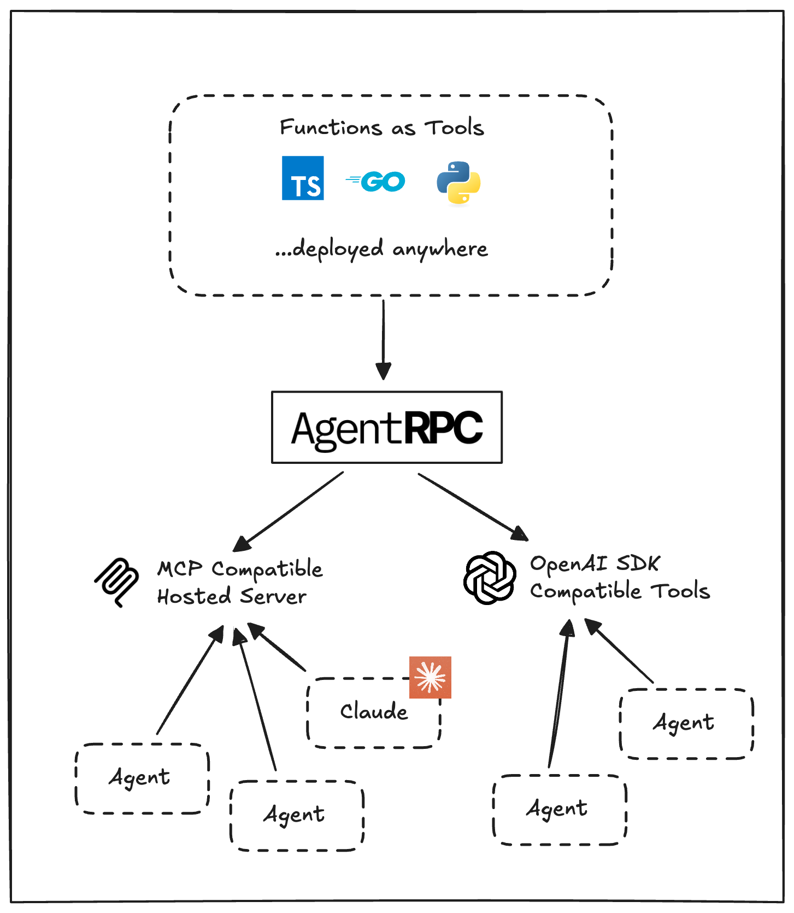

  

# AgentRPC

AgentRPC is a universal RPC layer for AI agents. It allows you to connect to any function, in any language, across network boundaries.

You might have services deployed in a private VPC, on Kubernetes, even across multiple clouds. AgentRPC gives you the tools to wrap your functions in a universal RPC interface, connecting them to a hosted RPC server that can be accessed from open standards like:

Model Context Protocol (MCP)
SDKs with OpenAI-compatible tool definitions (e.g. OpenAI, Anthropic, LiteLLM, OpenRouter, etc.)

## How it works
1. By using our tool registration SDK, you can register functions and APIs in any language.
2. The AgentRPC platform (api.agentrpc.com) will register the function, and monitor its health.
3. You get access to OpenAPI SDK compatible tool definitions, and a hosted MCP server to connect to compatible agents.

## Features

- **Multi-language Support**  
  Connect Agents to tools in multiple languages including TypeScript, Go, and Python (.NET coming soon).  

- **Private Network Support**  
  Register functions and APIs even in private VPCs with no open ports required.  

- **Long-running Functions**  
  Long polling SDKs allow you to call functions beyond HTTP timeout limits.  

- **Full Observability**  
  Tracing, metrics, and events with our hosted platform for complete visibility.  

- **Automatic Failover**  
  Platform keeps track of function health, performs automatic failover, and retries.  

- **Framework Compatibility**  
  Out-of-the-box support for MCP and OpenAI SDK compatible agents.

## Quick Start

Details for each SDK are located in their respective directories.

- [Go SDK](sdk-go/README.md)
- [Node.js SDK](sdk-node/README.md)
- [Python SDK](sdk-python/README.md)

[Get your API key](https://app.agentrpc.com)

Check out our [examples](./examples) directory for working code samples in each language.
