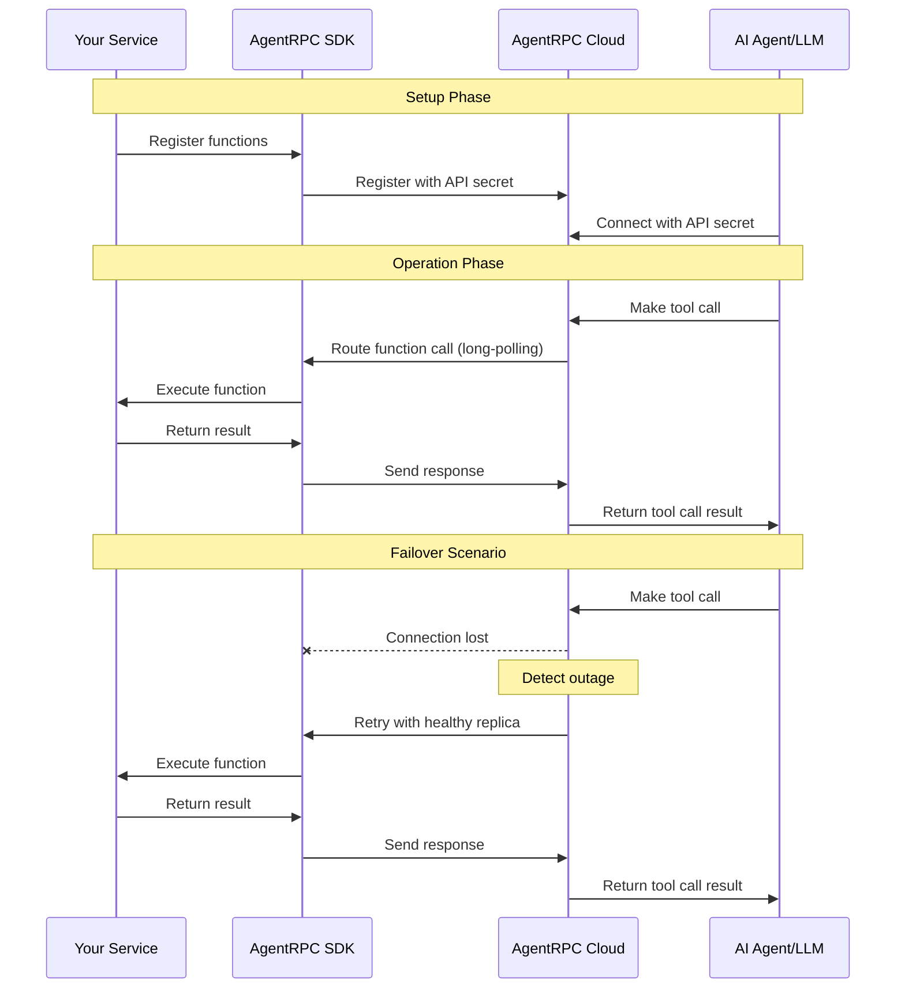

AgentRPC connects your functions to AI agents regardless of where they're deployed, providing a transparent integration between your existing services and AI capabilities.

<Steps>
  <Step title="Start with your existing service">
    You have an existing server running on your own compute infrastructure with functions you want to connect to an AI agent. These services can be running anywhere - in a private VPC, Kubernetes cluster, or even across multiple cloud providers.
  </Step>

  <Step title="Install SDK and register functions">
    Install the AgentRPC SDK for your language environment and wrap your function using your AgentRPC cluster API secret. The SDK provides a simple interface to register your function with minimal code changes.

    See the [registering tools](/tools) page for more information on how to register your function.
  </Step>

  <Step title="Long-polling connection">
    Once registered, your function is available in the AgentRPC cloud. The SDK establishes a long-polling connection to the AgentRPC platform, periodically checking for any incoming function calls from agents or LLMs.
    
    This outbound connection means you don't need to open any inbound ports, making it secure for services behind firewalls or in private networks.
  </Step>

  <Step title="Connect your agent">
    Connect your AI agent to the cluster using our OpenAI-compatible SDK or the Model Context Protocol (MCP) server. Simply use your cluster API secret to authenticate.

    See the [consuming tools](/integrations) page for more information on how to connect your agent.
  </Step>

  <Step title="Transparent tool execution">
    The agent can now call your registered tools as if they were local functions. When a tool call is initiated, AgentRPC serializes the parameters, routes the request to your service, and returns the results or errors back to the agent.
    
    This entire process is transparent to the agent, making remote function calls appear local.
  </Step>

  <Step title="Tool call routing">
    AgentRPC routes each tool call to the correct service running on your compute infrastructure, matching the function definition. 
    
    If you have multiple replicas of the same function (for redundancy in Kubernetes, for example), AgentRPC automatically load balances between the available instances to distribute the workload optimally.
  </Step>

  <Step title="Automatic failover">
    AgentRPC continuously monitors the health of your registered functions through telemetry data collected by the SDK. If a replica becomes unavailable, AgentRPC detects the outage and automatically routes requests to healthy replicas according to your retry configuration.
    
    This built-in failover mechanism ensures high availability of your tools without requiring additional infrastructure.
  </Step>
</Steps>
